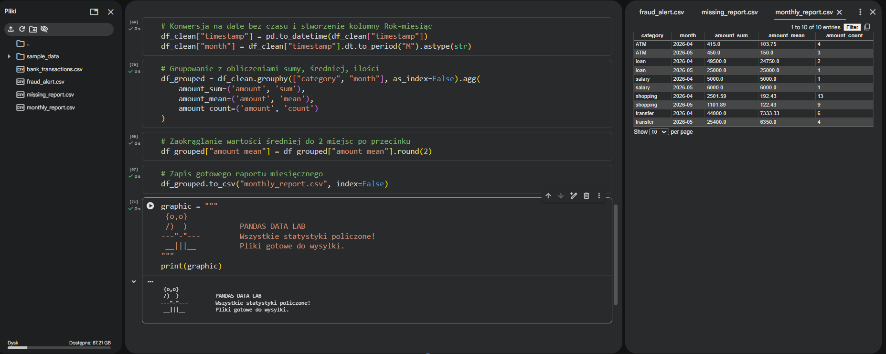

# Analityka danych bankowych (Python & Pandas)

Projekt prezentuje użycie biblioteki Pandas do szybkiej analizy i przetwarzania dużych zbiorów danych transakcyjnych (w formacie CSV) pod kątem bezpieczeństwa oraz raportowania biznesowego.

## Co robi ten projekt?
1. **Czyszczenie danych:** Wykrywa uszkodzone rekordy (braki w ID użytkownika lub kwotach), zapisuje ich numery transakcji do raportu dla administratora (`missing_report.csv`), a następnie usuwa je z głównego zbioru.
2. **Detekcja anomalii:** Filtruje transakcje powyżej 15 000 zł, które zostały wykonane spoza bezpiecznej sieci wewnętrznej banku (wykorzystanie biblioteki `ipaddress` do weryfikacji publicznych adresów IP). Wyniki trafiają do `fraud_alert.csv`.
3. **Agregacja biznesowa (BI):** Grupuje transakcje według kategorii oraz miesiąca, wyliczając łączną sumę wydatków, średnią kwotę oraz liczbę operacji. Raport zapisuje w pliku `monthly_report.csv`.

## Struktura plików
* `analytics.py` - skrypt parsujący dane za pomocą Pandas.
* `data/bank_transactions.csv` - baza testowa zawierająca 50 transakcji (w tym anomalie i braki danych).
* `missing_report.csv`, `fraud_alert.csv`, `monthly_report.csv` - automatycznie generowane pliki wynikowe.

## Podgląd działania programu w Google Colab

Oto wynik poprawnego wykonania skryptu, wygenerowane pliki oraz podgląd końcowego raportu miesięcznego:

